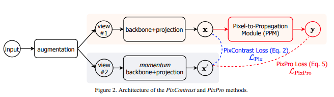

</img>

## Pixel-level Contrastive Learning

Implementation of Pixel-level Contrastive Learning, proposed in the paper <a href="https://arxiv.org/abs/2011.10043">"Propagate Yourself"</a>, in Pytorch. In addition to doing contrastive learning on the pixel level, the online network further passes the pixel level representations to a Pixel Propagation Module and enforces a similarity loss to the target network. They beat all previous unsupervised and supervised methods in segmentation tasks.

Update: Mostly done, but need someone to review the way the distance matrix, and consequent positive and negative pairs, are calculated

## Install

```bash
$ pip install pixel-level-contrastive-learning
```

## Usage

Below is an example of how you would use the framework to self-supervise training of a resnet, taking the output of layer 4 (8 x 8 'pixels').


```python
import torch
from pixel_level_contrastive_learning import PixelCL
from torchvision import models
from tqdm import tqdm

resnet = models.resnet50(pretrained=True)

learner = PixelCL(
    resnet,
    image_size = 256,
    hidden_layer_pixel = 'layer4',  # leads to output of 8x8 feature map for pixel-level learning
    hidden_layer_instance = -2,     # leads to output for instance-level learning
    projection_size = 256,          # size of projection output, 256 was used in the paper
    projection_hidden_size = 2048,  # size of projection hidden dimension, paper used 2048
    moving_average_decay = 0.99,    # exponential moving average decay of target encoder
    ppm_num_layers = 1,             # number of layers for transform function in the pixel propagation module, 1 was optimal
    ppm_gamma = 2,                  # sharpness of the similarity in the pixel propagation module, already at optimal value of 2
    distance_thres = 0.7,           # ideal value is 0.7, as indicated in the paper, which makes the assumption of each feature map's pixel diagonal distance to be 1 (still unclear)
    similarity_temperature = 0.3,   # temperature for the cosine similarity for the pixel contrastive loss
    alpha = 1.,                      # weight of the pixel propagation loss (pixpro) vs pixel CL loss
    use_pixpro = True                # do pixel pro instead of pixel contrast loss, defaults to pixpro, since it is the best one
).cuda()

opt = torch.optim.Adam(learner.parameters(), lr=1e-4)

def sample_batch_images():
    return torch.randn(10, 3, 256, 256).cuda()

for _ in tqdm(range(100000)):
    images = sample_batch_images()
    loss, positive_pixel_pairs = learner(images)

    # only update if there are positive pixel pairs
    # as defined by distance threshold
    # still needs further review https://github.com/lucidrains/pixel-level-contrastive-learning/issues/1
    if positive_pixel_pairs == 0:
        continue

    opt.zero_grad()
    loss.backward()
    print(loss.item())
    opt.step()
    learner.update_moving_average() # update moving average of target encoder

# after much training, save the improved model for testing on downstream task
torch.save(resnet, 'improved-resnet.pt')
```

## Citations

```bibtex
@misc{xie2020propagate,
    title={Propagate Yourself: Exploring Pixel-Level Consistency for Unsupervised Visual Representation Learning}, 
    author={Zhenda Xie and Yutong Lin and Zheng Zhang and Yue Cao and Stephen Lin and Han Hu},
    year={2020},
    eprint={2011.10043},
    archivePrefix={arXiv},
    primaryClass={cs.CV}
}
```
